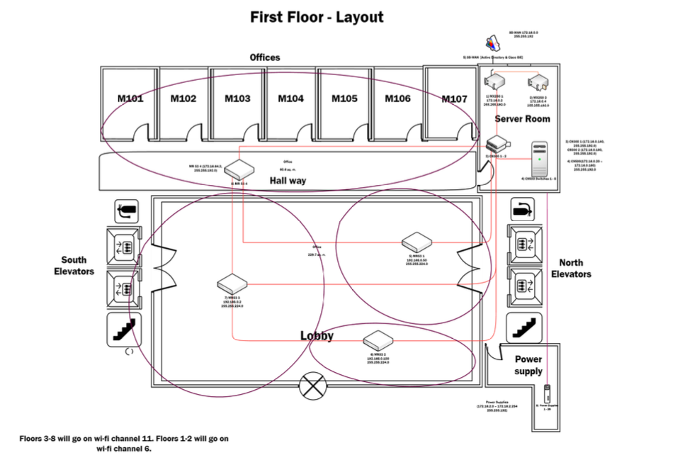
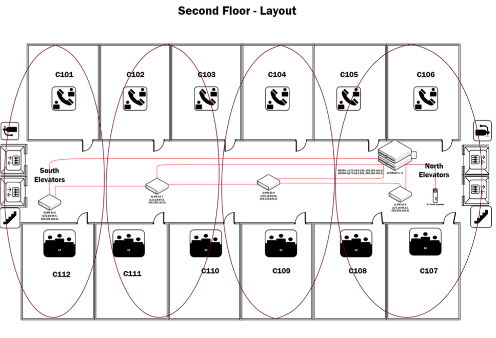
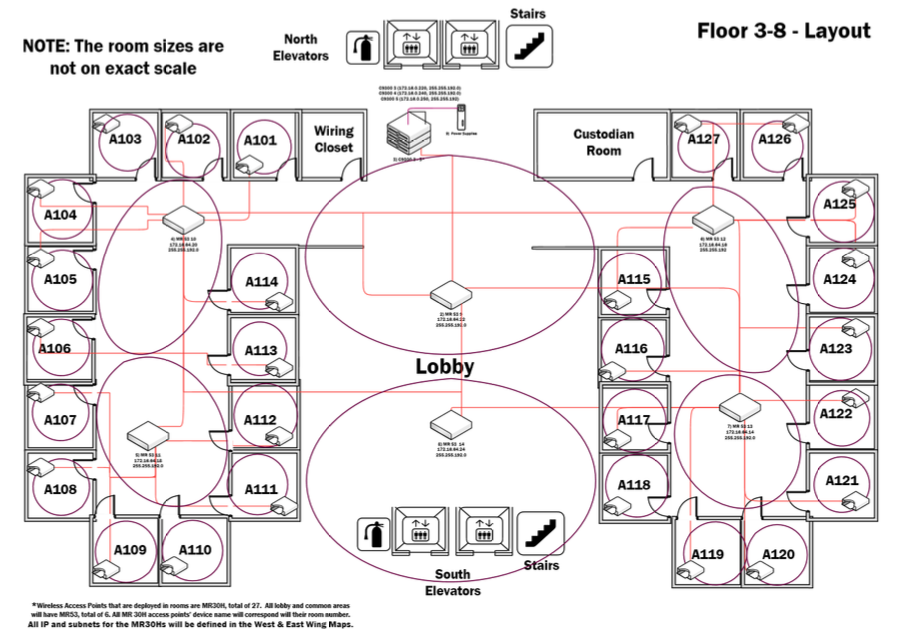

# College Apartment Network Design Project
The project focuses on building a robust, high-performance network for a luxury college apartment, balancing hospitality, reliability, and scalability. The primary focus was to apply real-world network design principles in a controlled academic setting.

## Project Overview
The network design simulates a hotel-style network setup catering to students, staff, and guests. 
The design incorporates:
- **High-Speed Wired and Wireless Access**: Optimized for multimedia services, online learning, and gaming.
- **Scalability**: Ability to support thousands of concurrent users.
- **Advanced Monitoring and Security**: Leveraging Cisco Meraki solutions for cloud-based visibility and secure SD-WAN.

## Features
- **Layered Network Design**:
  - Layer 2 and Layer 3 access designs for efficient routing and failover.
  - VLAN segmentation for secure, flexible network management.
- **Hardware and Software Recommendations**:
  - Devices like MX250 routers, C9300/C9500 switches, and MR53/MR30H access points.
  - Cloud-based management with licenses tailored for the deployment.
- **Optimized Wi-Fi Channels**:
  - Channels 1, 6, and 11 for minimal interference and maximum performance.
- **Total Cost Analysis**:
  - Comprehensive breakdown of hardware, licenses, and accessories.

## Diagram Overview
### First Floor

### Second Floor

### Third to Eight Floors

## Project Structure
1. **File name:** Klein_Trinity_16667_Network Design
- Documentation and report covering network design and diagrams
2. **File name:** Klein_Trinity_16667-FinalProject - FloorPLan
- Visio document of network diagrams
3. **File name:** diagram-3
- First Floor Diagram
4. **File name:** diagram-2
- Second Floor Diagram 
5. **File name:** diagram-1
- Third Floor Diagram
  
